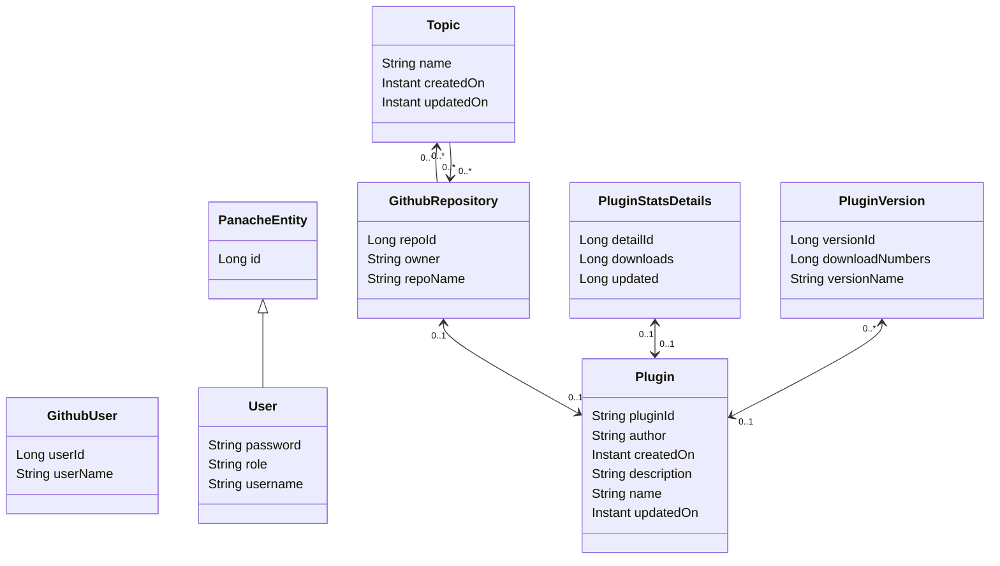

- Persistance view

```mermaid
classDiagram
direction BT
class GithubRepository {
    Long  repoId
    String  owner
    String  repoName
}
class GithubUser {
    Long  userId
    String  userName
}
class PanacheEntity {
    Long  id
}
class Plugin {
    String  pluginId
    String  author
    Instant  createdOn
    String  description
    String  name
    Instant  updatedOn
}
class PluginStatsDetails {
    Long  detailId
    Long  downloads
    Long  updated
}
class PluginVersion {
    Long  versionId
    Long  downloadNumbers
    String  versionName
}
class Topic {
    String  name
    Instant  createdOn
    Instant  updatedOn
}
class User {
    String  password
    String  role
    String  username
}

GithubRepository "0..*" --> "0..*" Topic 
Plugin "0..1" <--> "0..1" GithubRepository 
Plugin "0..1" <--> "0..1" PluginStatsDetails 
Plugin "0..1" <--> "0..*" PluginVersion 
Topic "0..*" --> "0..*" GithubRepository 
User  --|>  PanacheEntity 

```
- swagger-ui can be viewed [here](https://nhannht.online/q/swagger-ui/)
